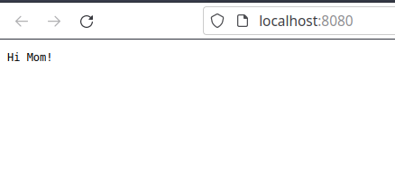

## Outline

On This day, we will be setting up our project, adding the dependencies for Javalin, 
and doing a quick Hello World(or Hi Mom!, if that's your thing) demo, and talk briefly about 
a few javalin basics.

## Create a new project

In your IDE of choice, create a new project based on Maven. This should produce a folder 
structure similar to this

```
PROJECT_ROOT
  |__src --> the folder containing all sources
  |   |__main --> the folder containing application sources
  |   |   |__java --> the folder containing java sources 
  |   |__test --> the folder containing test code
  |__pom.xml --> project definition file
  |__target --> (generated) folder for build results
```

## Maven pom.xml

POM stands for "Project Object Model", which is the way that Maven handles project management.
The ``pom.xml`` file we just created should look something like this

```xml
<?xml version="1.0" encoding="UTF-8"?>
<project xmlns="http://maven.apache.org/POM/4.0.0" xmlns:xsi="http://www.w3.org/2001/XMLSchema-instance" xsi:schemaLocation="http://maven.apache.org/POM/4.0.0 http://maven.apache.org/xsd/maven-4.0.0.xsd">
    <modelVersion>4.0.0</modelVersion>
    <groupId>com.conduit</groupId>
    <artifactId>day1</artifactId>
    <version>1.0.0-SNAPSHOT</version>
    <properties>
        <project.build.sourceEncoding>UTF-8</project.build.sourceEncoding>
        <maven.compiler.source>11</maven.compiler.source>
        <maven.compiler.target>11</maven.compiler.target>
        <exec.mainClass>com.conduit.run.Main</exec.mainClass>
    </properties>
</project>
```

the root tag is the ``<project>`` tag, which contains all the definitions for our current 
project, which start off with declaring the project's namespace in the ``<groupId>`` tag and 
the project's name in the ``<artifactId>`` tag Additionally, it contains a ``<properties>`` tag, 
which contains general project properties such as compiler flags, reusable variables, etc. 

The current project setup is the sane default used by maven, and will build and produce a ``jar``
file in the ``target`` directory.

## Adding Dependencies

To add dependencies to a ``pom.xml``, you need to add a ``<dependencies>`` tag inside the
``<project>`` root tag. each dependency is represented as a ``<dependency>`` tag  has a 
``<groupId>``, ``<artifactId>``, and ``<version>`` tag inside it. We want to start off by adding
the dependency for Javalin, so we need to add the following block to our ``pom.xml``

```xml
<dependencies>
    <dependency>
        <groupId>io.javalin</groupId>
        <artifactId>javalin</artifactId>
        <version>4.5.0</version>
    </dependency>
</dependencies>
```

Once we rebuild the project, it will automatically go to the 
[Maven Central](https://mvnrepository.com/repos/central){:target="_blank"} repository
and fetch the required dependencies.

The great thing about handling dependencies using maven is that you no longer need to concern 
yourself with the 
[classpath and dependency tree](https://maven.apache.org/guides/introduction/introduction-to-dependency-mechanism.html){:target="_blank"} 
for your project. Maven automatically handles transitive dependencies(ie, dependencies of 
dependencies), and generally knows how to resolve dependency version conflicts using
[semantic versioning](https://semver.org/){:target = "_blank"}.

## Hi Mom!

So Now lets open our main class, which in our case, is the class ``com.conduit.run.Main``. 
Our current ``main`` method currently looks like this

```java
public static void main(String[] args) {
    System.out.println("Hello World!");
}
```

we are going to change this to become

```java
public static void main(String[] args) {
    Javalin app = Javalin.create();
    app.get("/", ctx->{
        ctx.result("Hi Mom!");
    });
    app.start(8080);
}
```

and run it from our IDE. Afterwards, we visit [http://localhost:8080](http://localhost:8080){:target="_blank"}. We should be greeted with the following screen



Congratulations, you have successfully served your first response using javalin. Lets break down 
what  we did.

We started off by creating a new javalin application instance
```java
Javalin app = Javalin.create();
```
afterwards, we declared a rule, or **route** to return something to a user
```java
app.get("/", ctx->{
    ctx.result("Hi Mom!");
});
```
what the above statement means is that when
[HTTP Method](https://developer.mozilla.org/en-US/docs/Web/HTTP/Methods){:target="blank"} ``GET`` is made to the resource ``/`` - the root resource - we return the string ``result`` of 
``Hi Mom!`` to the person who made the request. the ``ctx`` object is the current request, which contains the contents of the request and lets us manipulate the response.
The full docs for the ``Context`` class can be found on the 
[Javalin Docsite](https://javalin.io/documentation#context){:target="_blank"}.

Javalin can handle many http methods in its routes, such as ``get``,``put``,``post``,``delete``, 
etc, and can return responses in multiple formats, all of which we will get into later on in the course.

Lastly, we ran our application server, which is what we did using 
```java
app.start(8080);
```
which started the listener on the port ``8080`` and starts accepting requests.

Now that we wrote a basic running server, lets take a closer look at some javalin concepts that 
we will be using frequently.